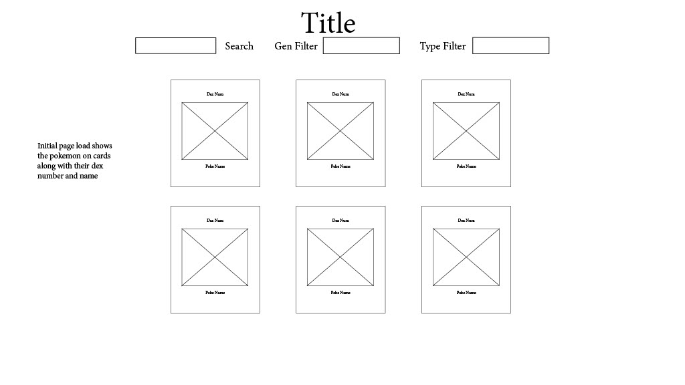
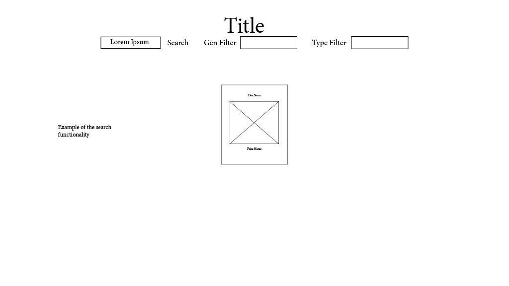
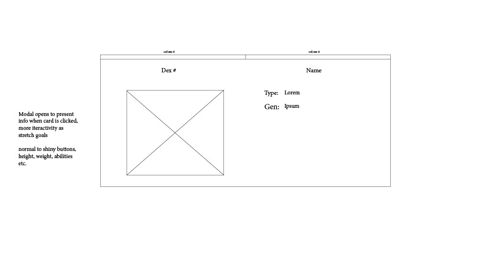

<h1 align="center">
   
  PokeDex
   
</h1>

<h4 align="center">Explore the world of Pokemon: An interactive Pokedex web app</h4>

## User Stories

As a user, I will be able to navigate through the PokeDex to find more information on my pokemon of choice. I can directly search for my pokemon, or I can use the filters to narrow down my results and look through a list of pokemon. I can find more info on the pokemon by clicking on its element and getting a pop displaying its info. I will aso be able to add create a team by clicking on 6 of my favorite pokemon. This team will be stored in a database that can be accessed with the "Team" button. When viewing a pokemon's data, there will be an option to "Add to team". CLicking on this will add the pokemon to the roster. Once 6 pokemon are selected, any new pokemon added to the roster will remove the first pokemon to make room for the new pokemon. 

 

## Deliverables

* Search for specific Pokemon across the generations ('submit' eventListener)
* Filter Pokemon by categories
* Sort Pokemon on page by attributes
* Select a Pokemon to view details on them ('click' eventListener)
* Card increases in scale on mouse over ('mouseOver' eventListener)
* User can create a team of 6 pokemon
  - Click on a pokemon, adding it to the battle roster, POST
  - The battle roster will be viewed when the "Team" button is clicked, GET
  - User can replace a pokemon from the roster with a new one, PATCH
  - User can delete a pokemon from the team, DELETE

 

## Bonus Deliverables

* Different color card background based on pokemon type
* Button to change between shiny and normal sprite
* Functionality to switch between front and back sprites
* Left and Right buttons in modal to switch to next or previous pokemon

 

## Wireframe

 

## Endpoint

https://pokeapi.co/api/v2/pokemon?limit=100000&offset=0

### Collaborators

<a href="https://github.com/Evan-Roberts-808">Evan-Roberts-808</a> • <a href="https://github.com/Mttphan261">Mttphan261</a> • <a href="https://github.com/amorwale">amorwale</a> • <a href="https://github.com/gjmedero">gjmedero</a> • <a href="https://github.com/gyimahgracie">gyimahgracie</a>

